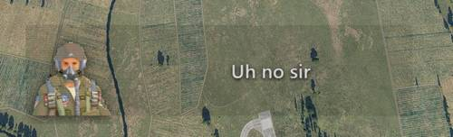

# Subtitle UI

Jesters subtitles are shown in a web-based frontend that also offers an API
exposed to Lua for showing any text. It also features full localization.



## Frontend

The frontend is a plain HTML website defined in

`f-4e\ModFolders\Mods\aircraft\F-4E\UI\JesterSubtitle`

Opening `index.html` in a browser shows the interface filled with a placeholder
text.

The website can be edited freely, changes are visible after reloading DCS
(<kbd>SHIFT</kbd>+<kbd>R</kbd>).

## Lua

To show custom text, the following methods are defined and exported to Lua:

```lua
Subtitle.ShowText(text, duration, showPortrait)
Subtitle.ShowFor(text)
```

As an example a Jester mod could write

```lua
Subtitle.ShowText("Hello World!", s(5), true)
```

and that would show the UI with the given text for 5 seconds, including Jesters
portrait.

> 💡 Users can still configure in their
> [Special Options](../../special_options.md#jester-subtitles) whether the UI or
> Jesters Portrait is allowed to begin with, the LUA functions respect this
> choice.
